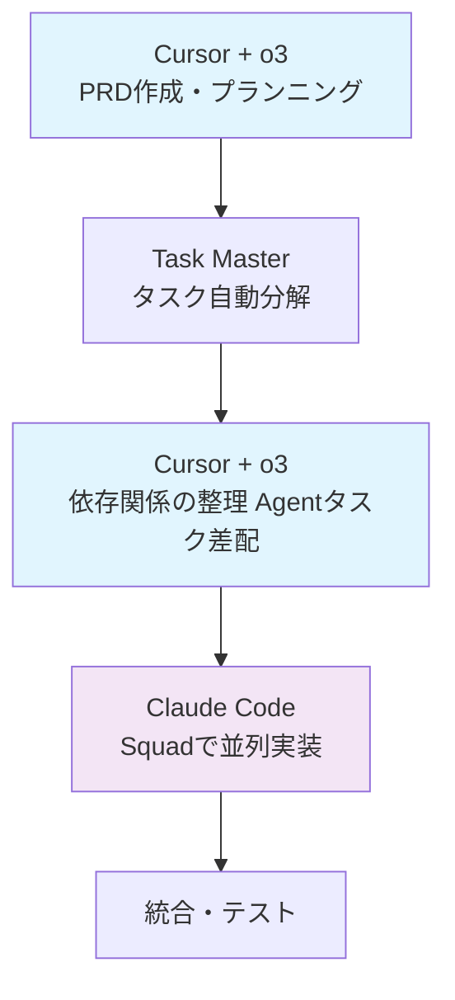

# ラクラク Claude Code 並列開発 ― Task Master & Squad 活用術

## はじめに

AIペアプログラミング時代において、Claude CodeやCursorを活用した開発が当たり前になってきました。しかし、単発のコード生成だけでなく、プロジェクト全体を効率的に管理し、複数のタスクを並列で進めるためのワークフローはまだ確立されていないのが現状です。

本記事では、話題のTask Master（claude-task-master）とSquadアプローチを組み合わせた並列開発の手法について、実践的な視点から解説します。

## 目次

1. [現代の開発における課題](#現代の開発における課題)
2. [Claude Task Masterとは](#claude-task-masterとは)
3. [Claude Squadとは](#claude-squadとは)
4. [並列開発ワークフロー実践編](#並列開発ワークフロー実践編)
5. [実践的な活用例](#実践的な活用例)
6. [Tips & Tricks](#tips--tricks)
7. [まとめ](#まとめ)

## 現代の開発における課題

### vibe codingの限界

AIペアプログラミングツールが普及し、Claude CodeやCursorを使った開発が当たり前になってきました。しかし、多くの開発者が経験する「vibe coding」（その場の雰囲気や直感でコードを書く開発スタイル）には大きな問題があります。

**「結局自分で書いた方が早かった」問題**

- AIに依頼したものの、期待通りの結果が得られない
- 修正や調整に時間がかかり、最終的に手動で書き直すことになる
- コンテキストの共有が不十分で、AIが意図を理解できない
- 単発のタスクベースでの依頼により、全体最適化されていない

### セッション管理における根本的課題

Claude Codeでの開発において、イシューの規模によって大きく異なる課題が存在します。比較的小さなイシュー（バグ修正や単一機能追加など）は一つのセッションで効率的に対応できる一方、**大きなイシューでは深刻な問題が発生**します。

#### 大きなイシューでの「セッション管理の罠」

```
❌ 一つのセッションで大きなイシューを対応しようとすると...

1. コンテキスト肥大化の問題
   - セッション後半でのコード生成精度低下
   - 過去の会話履歴による混乱
   - メモリ制限による重要情報の欠落

2. ゴール迷子問題
   - 当初のイシューのゴールを見失う
   - 派生タスクに意識が分散
   - 完了条件が不明確になる

3. 責任範囲の曖昧化
   - 何をどこまでやるべきか不明
   - 複数の関心事が混在
   - テスト戦略の一貫性欠如
```

#### 実際の開発者の声

> 「新機能開発を一つのセッションでやろうとしたら、最初は順調だったのに途中からClaude Codeの回答がおかしくなって、最終的に半分以上書き直すハメになった...」

> 「大きなリファクタリングをお願いしたら、途中で元々何をしたかったのか分からなくなって、結局小さく分けてやり直した」

#### 解決に必要なアプローチ

大きなイシューを効率的に処理するためには、以下のアプローチが必要です：

```
✅ 効果的な大規模開発のための要件

1. 事前Planning
   - イシューのゴール明確化
   - 達成条件の具体的定義
   - 作業範囲の境界設定

2. タスク分解戦略
   - セッション単位での責任範囲定義
   - 依存関係の明確化
   - 並列実行可能な部分の特定

3. コンテキスト管理
   - 各セッションで必要な情報の整理
   - 状態管理とナレッジ継承
   - 一貫性を保つためのガイドライン
```

### 従来の並列開発における課題

この問題を解決するために、タスクを適切に分割し、複数のエージェントに並列で作業を依頼する手法が注目されています。しかし、従来のアプローチには以下のような課題がありました。

#### 1. タスク分けとプランニングの複雑さ

```
❌ 従来の問題点
- イシューを解決するためのタスク分けにプロンプトエンジニアリングが必要
- Critical pathの特定と依存関係の整理が手動作業
- PRD（Product Requirements Document）からタスクへの分解が属人的
- タスクの粒度や優先度の判断に経験とスキルが必要
```

#### 2. 並列開発環境の管理負荷

```
❌ 従来の問題点
- git worktreeを手動で管理する必要がある
- ブランチの作成、切り替え、マージが煩雑
- 複数のワークスペースでの作業状況把握が困難
- コンフリクト解決やブランチ間の依存関係管理が複雑
```

#### 3. エージェント間の協調の困難さ

```
❌ 従来の問題点
- 各エージェントが独立して作業するため、整合性の確保が困難
- 依存関係のあるタスク間での情報共有が不十分
- 進捗管理と統合作業が手動で非効率
- テストやレビューのワークフローが分散化
```

### 解決すべき根本課題

これらの問題を整理すると、以下の4つの根本課題が浮かび上がります：

1. **タスク分解の自動化**: プロンプトエンジニアリングに頼らない効率的なタスク分割
2. **セッション責任範囲の明確化**: 各セッションで何を達成すべきかの明確な定義
3. **コンテキスト管理の最適化**: セッション間での情報継承と肥大化防止
4. **並列環境の簡素化**: git worktreeを意識しない透明な並列開発環境

### Task MasterとSquadによる解決アプローチ

これらの課題に対して、Task MasterとSquadは以下のような解決策を提供します：

#### Task Master → セッション設計の自動化
```
課題: 大きなイシューをどうセッション単位に分けるか？
解決: PRDから自動でセッション適切なタスクサイズに分解

- 各タスクが1セッションで完了可能な粒度に調整
- タスク間の依存関係を明示してゴール迷子を防止
- 各タスクの完了条件と成功基準を明確化
```

#### Squad → 並列セッション管理の自動化
```
課題: 複数セッションをどう管理し統合するか？
解決: 自動ワークスペース管理で並列セッションを実現

- 各タスクが独立したセッション環境で実行
- コンテキスト肥大化を回避した専用環境
- 統合時の一貫性確保とコンフリクト自動解決
```

次章では、これらの課題を解決するTask MasterとSquadについて詳しく解説します。

## Claude Task Masterとは

### 概要

**Task Master（claude-task-master）**は、Cursor、Windsurf、VS Codeなどのエディタで動作するAI駆動のタスク管理システムです。PRD（Product Requirements Document）を入力するだけで、プロジェクトを効率的なタスクに自動分解し、開発プロセス全体を構造化してくれます。

[Task Master GitHub リポジトリ](https://github.com/eyaltoledano/claude-task-master)で12.9k+ starsを獲得している人気ツールで、MCP（Model Control Protocol）を使用してエディタと統合されます。

### サポートされるエディタ・プラットフォーム

- **Cursor AI** (推奨)
- **Windsurf**
- **VS Code**
- **Lovable**
- **Roo Code**

### 必要なAPI キー

Task Masterは複数のAIプロバイダーをサポートしており、最低1つのAPIキーが必要です：

```
サポートされるAIプロバイダー:
✅ Anthropic API (Claude)
✅ OpenAI API
✅ Google Gemini API
✅ Perplexity API (研究用モデル推奨)
✅ xAI API
✅ OpenRouter API
✅ Mistral API
✅ Azure OpenAI API
```

### セットアップ方法

Task Masterの詳細なインストール手順やMCP設定方法は、公式READMEをご参照ください。

- GitHub: <https://github.com/eyaltoledano/claude-task-master>
- Quick Start: <https://task-master.dev>

ここでは概要のみを示します。

```
# CLI 例（詳細は公式ドキュメント参照）
npm install -g task-master-ai   # グローバルインストール
npx task-master init           # プロジェクト初期化
```

---

## Claude Squadとは

### 概要

**Claude Squad**は、複数のAIエージェント（Claude Code、Aider、Codex、Amp）を並列管理するターミナルアプリケーションです。各エージェントを独立したワークスペースで動作させ、複数タスクを同時実行することで、コンテキスト肥大化を回避しながら効率的な並列開発を実現します。

[Claude Squad GitHub リポジトリ](https://github.com/smtg-ai/claude-squad)で1.2k+ starsを獲得しており、tmuxとgit worktreesを組み合わせた自動ワークスペース管理機能を提供します。

### 主な機能

- **並列エージェント管理**: 複数のAIエージェントを独立したセッションで実行
- **自動ワークスペース分離**: git worktreesによる各タスクの独立ブランチ管理
- **バックグラウンド実行**: auto-acceptモードでタスクの自動完了
- **統合ターミナルUI**: 一つのウィンドウで全インスタンスとタスクを管理

### セットアップ方法

Claude Squadの詳細なインストール手順は、公式READMEをご参照ください。

- GitHub: <https://github.com/smtg-ai/claude-squad>
- ドキュメント: <https://smtg-ai.github.io/claude-squad/>

```bash
# Homebrew経由でのインストール
brew install claude-squad
ln -s "$(brew --prefix)/bin/claude-squad" "$(brew --prefix)/bin/cs"

# 手動インストール
curl -fsSL https://raw.githubusercontent.com/smtg-ai/claude-squad/main/install.sh | bash
```

### 使用例

```bash
# 基本起動
cs

# claude codeで起動
cs -p "claude code"

# auto-acceptモードで起動
cs -y
```

## 並列開発ワークフロー実践編

読者が実際に自身のプロジェクトで活用できる、**Cursor + o3 + Task Master + Claude Squad** による並列開発ワークフローの実践手順を詳細に解説します。

### ワークフローの背景とツール連携

このワークフローでは、各ツールの特性を活かした役割分担を行います：

#### Cursorとo3の戦略的活用

**Cursor NotePad + o3**によるPRD生成から始まり、**o3の優れたcodebase調査・理解・プランニング能力**を活用してCritical Path分析とエージェント差配を行います。

**Cursorを選ぶ理由：**
- **視認性**: マークダウン出力が見やすく、Mermaid図でCritical Pathを視覚化可能
- **インターフェース**: Claude CodeのCLIと比較して、プランニング作業に適したUI
- **o3統合**: codebaseコンテキストを活用した高精度な分析

#### 役割分担の明確化



**各フェーズでの責任範囲：**
- **Cursor + o3**: PRD生成、Critical Path分析、エージェント差配、プロンプト生成
- **Task Master**: PRDからタスクへの自動分解、依存関係設定
- **Claude Code**: 具体的な実装タスクに集中した開発作業

### 5段階並列開発フロー

#### Stage 1: PRD生成と要件整理

**o3の推論能力を活用した効率的なPRD生成**

このステージでは、**o3の優れた推論能力**を活かして、シンプルなプロンプトから包括的なPRDを自動生成します。o3は文脈理解と構造化思考に長けているため、詳細な指示なしでも実用的なPRDを作成できます。

##### 1.1 NotePadでの要件テンプレート準備

Cursor の **NotePad** にPRDテンプレートを貼り付けます。このテンプレートは、o3が構造化されたPRDを生成するための参照フレームワークとして機能します：

```markdown
# Context
- Why this product now?
- Stakeholders / target users

# Problem
- Core pain points (≤ 3 bullets)

# Goal & Success
- Business KPI
- User outcome

# Core Features
1. Feature A
2. Feature B
3. Feature C
(*each = dev task grain*)

# UX Flow
- 3-step happy path
- Link to wireframes (Figma)

# Tech Notes
- Frontend: ___
- Backend: ___
- Key trade-offs

# Roadmap
| Phase | Scope | Done-when |
|------|-------|-----------|
| MVP | A+B | Beta live |

# Risks & Mitigations
- Risk → Guardrail

# Out of Scope
- Anything explicitly postponed
```

##### 1.2 o3によるPRD自動生成

**プロンプト例:**
```text
下記の機能の包括的な @PRD を作成して

[具体的な機能要望]
```


#### Stage 2: Task Master による自動タスク分解

##### 2.1 Task Master による自動タスク生成

このステージでは、**Task MasterのMCP（Model Context Protocol）連携**により、PRDファイル保存からタスク生成まで一つのプロンプトで完結します。MCPにより、Task Masterツールが直接Cursorと統合されているため、手動でのファイル操作は不要です。

##### 2.1 MCP連携による自動タスク生成

**シンプルなプロンプトで全処理を自動実行：**

```text
上記PRDを.taskmaster/docs/prd.txt に保存してparse_prdを実行して
```

**MCP連携の利点：**
- **完全自動化**: ファイル保存・ツール実行・結果取得が一気通貫
- **エラー処理**: MCPレベルでの自動エラーハンドリング
- **一貫性保証**: プロジェクト設定に基づく適切なタスク粒度

**自動生成される成果物：**
- **12-20個の実装タスク**: プロジェクト規模に応じた適切な粒度
- **依存関係の自動設定**: 技術的制約に基づく論理的な順序
- **カテゴリ分類**: Backend/Frontend/Infrastructure等への自動分類

**典型的なタスクカテゴリ:**
- Setup & Configuration
- UI Components & User Experience
- State Management & Data Flow
- API Integration & Backend Logic
- Performance Optimization
- Testing & Documentation

#### Stage 3: o3による戦略的タスク分析

**o3による依存関係分析とCritical Path最適化**

このステージでは、**o3の優れたシステム思考とプランニング能力**を活用して、タスク間の依存関係を分析し、Critical Pathを特定した上で最適な並列実行戦略を立案します。依存関係分析とCritical Path分析は密接に関連しており、o3はcodebaseの理解に基づいて両者を統合的に処理できます。

##### 3.1 ワンショット戦略立案とエージェント差配

**o3の高度な推論能力により、戦略立案からプロンプト生成まで一気通貫：**

```text
生成されたタスクリストを基にタスクの依存関係とcritical path最適化を意識して、複数のエージェントでの最適な並列実行戦略を立案し、依存関係をMermaid図で可視化、それぞれのsession名とプロンプトを提示して
```

**o3が自動生成する包括的な成果物:**
- **依存関係分析**: タスク間の技術的・論理的な依存関係の特定
- **Critical Path可視化**: 最長実行経路をMermaid図で明確化
- **並列実行戦略**: 依存関係を考慮した最適なエージェント配分
- **Session名**: 役割が明確な実用的な命名
- **実行可能プロンプト**: 各エージェントが即座に開始できる具体的指示

#### Stage 4: Claude Squad による並列実行

##### 4.1 エージェントセットアップ

**Claude Squad 起動:**
```bash
# 3つのセッション作成
cs new-session "agent-a"
cs new-session "agent-b"
cs new-session "agent-c"
```

##### 4.2 各エージェントへの作業指示

**前のステップで生成されたプロンプト例:**
```text
あなたは[専門領域]エキスパートとして、以下のタスクを担当してください：

担当タスク: Task [ID], [ID], [ID]
技術スタック: [具体的な技術]
品質基準: [パフォーマンス要件等]

他エージェントとの連携: [依存関係の説明]
```

**Task Masterステータス自動更新の利点：**

各プロンプトの最後に下記のTask Masterのステータス更新ルールを含めることで、**Claude Codeが自動的にタスク完了時のステータス更新を実行**してくれます。これにより：

- **自動進捗管理**: 開発者が手動でステータス更新する必要がなくなる
- **リアルタイム同期**: 他エージェントが依存関係をリアルタイムで確認可能
- **漏れ防止**: タスク完了の報告忘れを自動的に防止
- **全体把握**: プロジェクト進捗を常に正確に把握

```text
実装開始時は必ず以下を実行：
1. get_task --id=[タスクID] でタスク詳細確認
2. set_task_status --id=[タスクID] --status=in-progress
3. 実装完了時は set_task_status --id=[タスクID] --status=done
```

#### Stage 5: 統合・レビュー・デプロイ

**並列作業完了後の統合プロセス**

Stage 4では各エージェントが並列実行中、基本的には**見守り**に徹します。道を外れそうになった場合のみ軌道修正の指示を出すだけで、Claude Codeが自律的にタスクを完了します。

##### 5.1 各エージェントでのプルリクエスト作成

全タスク完了後、各セッションでプルリクエスト作成を指示：

```text
プルリクエストを作成して
```

**自動化される処理:**
- ブランチ名: 機能に応じた適切な命名
- PR説明: 実装内容とテスト結果の自動記載
- 品質チェック: lintやtypecheckの自動実行

##### 5.2 統合とマージ

```bash
# 統合ブランチ作成
git checkout -b integration/[機能名]

# 各エージェントのPRをマージ
git merge feature/[エージェントA-ブランチ]
git merge feature/[エージェントB-ブランチ]
git merge feature/[エージェントC-ブランチ]
```

**完了**: 統合テストが通れば、メインブランチへのマージで開発完了。

## まとめ

大きなイシューでのClaude Code活用における「コンテキスト肥大化」問題を、Task MasterとClaude Squadによる並列開発手法で解決しました。

**Task Master**でPRDから自動タスク分解、**o3**で依存関係分析と戦略立案、**Claude Squad**で並列実行を行うことで、従来の50-70%の時間で高品質な開発を実現できます。

今日から始められる実践的なワークフローとして、AI時代の開発効率向上にぜひ活用してください。

## 参考資料

- [Task Master GitHub リポジトリ](https://github.com/eyaltoledano/claude-task-master)
- [Task Master 公式サイト](https://task-master.dev)
- [Cursor AI 公式ドキュメント](https://docs.cursor.com)
- [MCP (Model Control Protocol) 公式ドキュメント](https://modelcontextprotocol.io)
