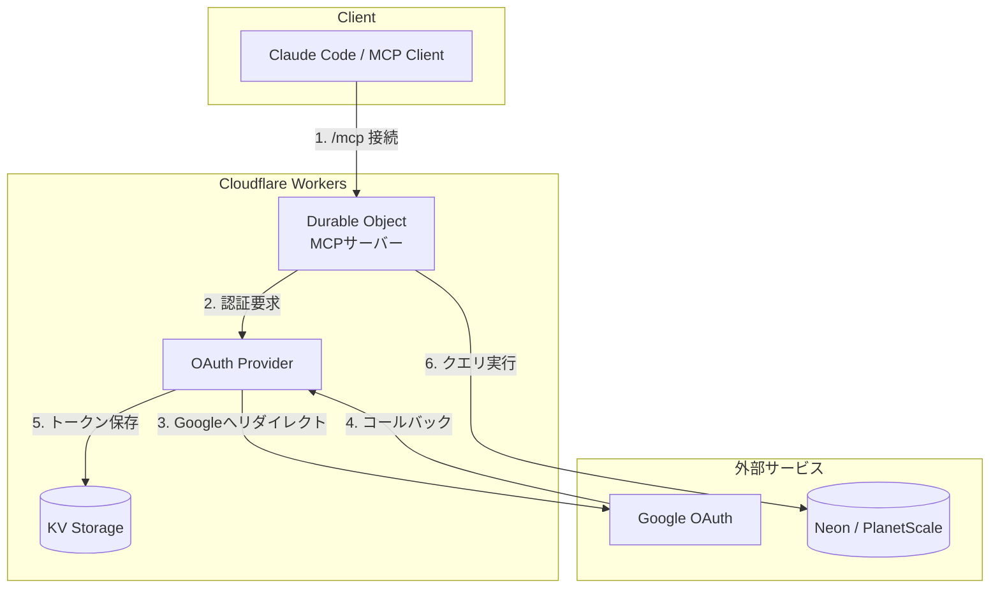

## はじめに

MCPサーバーをローカルで動かしている方は多いと思いますが、**リモートMCPサーバー**を構築したことはありますか？

ローカルMCPには以下のような課題があります：

- **環境依存**: 各開発者がローカルにセットアップする必要がある
- **セキュリティ**: DBの接続情報を各端末に配布する必要がある
- **共有困難**: チームで同じMCPサーバーを使いたい場合に面倒

リモートMCPサーバーなら、OAuth認証で安全にアクセス制御しながら、チーム全員が同じエンドポイントを利用できます。

本記事では、**Cloudflareが提供するテンプレート**と**Documentation MCP**を活用して、バイブコーディングでOAuth認証付きリモートMCPサーバーを構築する方法を紹介します。

## 全体アーキテクチャ



### 構成の概要

- **Cloudflare Workers**: サーバーレス環境でMCPサーバーをホスト
- **Durable Objects**: 状態管理（MCPセッション）
- **OAuth Provider**: 認証フローを処理
- **KV Storage**: トークンの永続化
- **外部DB**: Neon（PostgreSQL）やPlanetScale（MySQL）と連携

## Cloudflareテンプレートで始める

Cloudflareは様々な認証方式に対応したMCPサーバーテンプレートを提供しています。**コードを書かずにテンプレートを選ぶだけで、OAuth認証付きMCPサーバーの雛形が手に入ります**。

### テンプレート一覧

| テンプレート | 認証方式 | ユースケース |
|-------------|---------|-------------|
| `remote-mcp-authless` | なし | 公開API、プロトタイプ |
| `remote-mcp-google-oauth` | Google OAuth | 社内ツール（Googleアカウント） |
| `remote-mcp-github-oauth` | GitHub OAuth | 開発者向けツール |
| `remote-mcp-cf-access` | Cloudflare Access | エンタープライズSSO |
| `remote-mcp-auth0` | Auth0 | 既存Auth0連携 |
| `remote-mcp-authkit` | WorkOS AuthKit | B2B SaaS |
| `remote-mcp-descope-auth` | Descope | ノーコード認証 |
| `remote-mcp-logto` | Logto | オープンソース認証 |

### プロジェクトの作成

Google OAuth認証付きのMCPサーバーを作る場合：

```sh
npm create cloudflare@latest -- my-mcp-server --template=cloudflare/ai/demos/remote-mcp-google-oauth
```

これだけで、以下が揃ったプロジェクトが生成されます：

- OAuth認証フローの実装
- MCPサーバーの基本構造
- Durable Objects + KV の設定
- wrangler.jsonc（デプロイ設定）

あとはGoogle Cloud ConsoleでOAuthクライアントを作成し、環境変数を設定するだけです。

:::message
テンプレートの最新情報は [cloudflare/ai リポジトリ](https://github.com/cloudflare/ai/tree/main/demos) で確認できます。
:::

## Cloudflare Documentation MCPで調べながら実装

テンプレートをベースに機能を追加する際は、**Cloudflare Documentation MCP**を活用することで、ドキュメントを参照しながらバイブコーディングで実装できます。

### Documentation MCPとは

Cloudflareが公式に提供しているMCPサーバーで、Cloudflareのドキュメント全体を検索・参照できます。Claude CodeやCursorに接続すれば、「Workers KVの使い方を教えて」「Durable Objectsでセッション管理する方法は？」といった質問に、最新のドキュメントを元に回答してもらえます。

### Claude Codeへの接続

```json
{
  "mcpServers": {
    "cloudflare": {
      "command": "npx",
      "args": ["mcp-remote", "https://docs.mcp.cloudflare.com/sse"]
    }
  }
}
```

### バイブコーディングのメリット

1. **最新情報**: ドキュメントが常に最新の状態で参照される
2. **コンテキスト理解**: Cloudflare特有の概念（Durable Objects、KV、D1など）を正しく理解した上でコード生成
3. **ベストプラクティス**: 公式ドキュメントに基づいた実装パターン

例えば「Google OAuthでドメイン制限を追加したい」と聞けば、`hostedDomain`パラメータの使い方を教えてもらえます。

## DB SDKで自然言語クエリを実現

MCPサーバーの真価は、**AIがデータベースに自然言語でアクセスできる**ようになることです。

### サーバーレス対応のDB SDK

Cloudflare Workers環境で使えるDB SDKを活用すれば、簡単にデータベース接続を実装できます：

| SDK | データベース | 特徴 |
|-----|------------|------|
| `@neondatabase/serverless` | Neon (PostgreSQL) | サーバーレス最適化、ブランチ機能 |
| `@planetscale/database` | PlanetScale (MySQL) | Vitess基盤、スケーラブル |

これらのSDKは、HTTP経由でクエリを実行するため、Cloudflare Workersの制約（TCP接続不可）を回避できます。

### Read-Only設計の重要性

MCPサーバーからのDB操作は**Read-Only**に限定することを強く推奨します：

- **安全性**: AIが誤ってデータを変更・削除するリスクを排除
- **監査**: 読み取り操作のみなので、ログ分析が容易
- **レプリカ活用**: 読み取り専用レプリカに接続することで本番DBへの負荷を軽減

PlanetScaleならレプリカホストに接続することで、書き込みは自動的にDB側で拒否されます。

## 実装のポイント

テンプレートをカスタマイズする際に押さえておきたいポイントです：

### 1. Propsでユーザー情報を受け取る

OAuth認証後、MCPサーバー内で`props`としてユーザー情報（name、email、accessToken）を受け取れます。これを使って：

- ユーザーごとのアクセス制御
- 監査ログの記録
- 外部APIへの代理アクセス

### 2. MCPリソースでスキーマドキュメント提供

LLMがDBを効果的に操作できるよう、テーブル構造や注意事項をMCPリソースとして提供すると精度が向上します。

### 3. ドメイン制限でアクセス制御

Google OAuthの`hostedDomain`パラメータを使えば、特定のドメイン（例：`@example.com`）のユーザーのみにアクセスを制限できます。社内ツールに最適です。

## 活用事例：非エンジニアによるデータドリブン意思決定

私はこのアーキテクチャを使って、社内の複数のMCPサーバーを構築・運用しています。

### 構築したMCPサーバー

不動産事業部の営業支援ツールや社内システムのDBに接続するMCPサーバーを複数構築し、事業部メンバーに展開しました。Google OAuthでドメイン制限をかけているため、社内メンバーのみがアクセスできます。

### 非エンジニアがDBを直接活用

これにより、**エンジニアを介さずに**事業部メンバーが自然言語でDBのデータを直接抽出・分析できるようになりました：

- 「先月の成約案件の一覧を出して」
- 「エリア別の商談進捗を集計して」
- 「前年同月比で売上はどう変化している？」

SQLを知らなくても、**自然言語で質問するだけで即座にデータを取得**できるようになっています。

### データドリブンな意思決定へ

データへのアクセス障壁が下がったことで、事業部メンバーが自らデータから示唆を得て、データドリブンな意思決定を行う文化が生まれつつあります。

## まとめ

Cloudflare WorkersでOAuth認証付きリモートMCPサーバーを構築するには：

1. **テンプレートを選ぶ**: `npm create cloudflare@latest`で認証方式に応じたテンプレートを選択
2. **Documentation MCPで調べながら実装**: バイブコーディングで効率的にカスタマイズ
3. **DB SDKで接続**: Neon/PlanetScaleのサーバーレスSDKを活用

コードを一から書く必要はありません。テンプレートとドキュメントMCPを駆使して、効率的にリモートMCPサーバーを構築しましょう。

## 参考リンク

- [Cloudflare MCP テンプレート](https://github.com/cloudflare/ai/tree/main/demos)
- [Build a Remote MCP server - Cloudflare Docs](https://developers.cloudflare.com/agents/guides/remote-mcp-server/)
- [MCP Authorization - Cloudflare Docs](https://developers.cloudflare.com/agents/model-context-protocol/authorization/)
- [Cloudflare Documentation MCP](https://docs.mcp.cloudflare.com)
- [Neon Serverless Driver](https://neon.tech/docs/serverless/serverless-driver)
- [PlanetScale Serverless Driver](https://planetscale.com/docs/tutorials/planetscale-serverless-driver)
